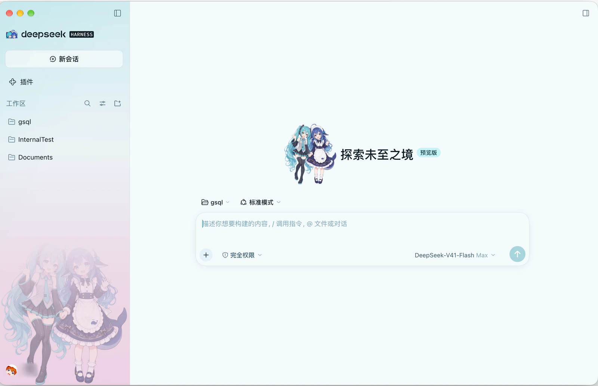

# dsh-theme-miku

初音未来主题，给 [DeepSeek Harness](https://github.com/deepseek-ai/deepseek-harness) 的 Web GUI。

青绿 × 品红的双色配色，浅色与深色各一套完整调色板；侧边栏底图；舞台光背景；
新会话首页与侧边栏品牌位的立绘。



*浅色配色下的实际界面：侧边栏品牌位换成两人头像、底部水印、新会话页 hero 插画。*

## 安装

插件以**本地目录 + profile patch** 的方式挂载：不需要发布到 npm，也不需要
`pnpm add`。

**1. 克隆到任意目录**（下面以 `~/dsh-theme-miku` 为例）

```bash
git clone https://github.com/MikuSugar/dsh-theme-miku.git ~/dsh-theme-miku
```

**2. 在 profile patch 里加一行**

编辑 `~/.dsh/profiles/<你的 profile>/cordis.patch.yml`（桌面端是 `desktop`），
在文件末尾追加——**把路径换成你实际克隆的位置**：

```yaml
# 初音未来主题
- insert:
    - id: dsh-theme-miku
      name: /Users/you/dsh-theme-miku/lib/index.js

# 侧边栏品牌位是 single 槽、先注册者胜出，插件整行接管 mark + name，
# 所以要让官方品牌行让位（该包 README 给出的正是这条替换路线）
- id: ui-brand-official
  name: "@deepseek-ai/dsh-client-ui-brand-official"
  disabled: true
```

**3. 保存即可**

`dsh-hmr` 会实时挂载，不用重启。装好后在 `设置 → 通用 → 初音未来主题` 里
开关主题与舞台光背景。

> 用绝对路径而不是包名，所以 Loader 之外没有任何依赖：浏览器半的模块扫描器会从
> `lib/index.js` 向上找到最近的 `package.json`，取它的 `name`（`dsh-theme-miku`）
> 作为浏览器模块名——这正是 `lib/client.js` 里
> `__ModuleLoader__.load({ id: 'dsh-theme-miku' })` 必须一致的那个 id。

## 文件结构

```
~/.dsh/profiles/desktop/plugins/miku-theme/
├── package.json                 声明 dsh.client（浏览器半）与 exports["./client"]
├── lib/
│   ├── index.js                 Host 半：空插件，仅作为被扫描的 Loader 行存在
│   └── client.js                浏览器半：调色板 + token 图层 + 设置行 + 作用域样式表
├── tools/
│   └── build-art.mjs            把 art/ 里的图内联进 bundle（见下）
├── test/
│   ├── verify.sh                离线自检（语法 / 声明 / token / 行为 / profile 接线）
│   ├── behaviour.mjs            行为断言：主题服务替身 + 用户可观察状态
│   └── wiring.mjs               品牌槽占用与 profile patch 断言
├── art/
│   ├── hero.png / mark.png      立绘原图（构建输入）
│   ├── preview-*.png            效果预览
│   └── README.md                出图提示词与裁切说明
└── README.md                    本文件
```

`lib/art.js` 是 `build-art.mjs` 的中间产物，与 `lib/client.js` 里内联的是同一份
数据，因此在 `.gitignore` 里——仓库里的 bundle 已经包含图，克隆后开箱即用。

## 开启 / 关闭

`设置 → 通用 → 初音未来主题` 两个开关：

| 开关 | 作用 | 记住位置 |
|---|---|---|
| 启用初音未来主题 | 叠上整套调色板图层 | `localStorage['dsh-theme-miku:enabled']` |
| 舞台光背景 | 界面后方流动的青绿/品红极光与扫描线纹理 | `localStorage['dsh-theme-miku:backdrop']` |

背景开关与调色板解耦：可以只用配色不要背景光。样式上由两个独立属性控制——
`data-dsh-miku`（图层生效）和 `data-dsh-miku-bg`（背景生效）——所以关掉任一
个都不会让规则残留。

**彻底移除**：删掉 profile patch 里那段 `insert`（`dsh-hmr` 会实时卸载，无需
重启），或给该行加 `disabled: true`。

## 设计要点（为什么是 overrideTokens 而不是注册主题）

主题服务提供两条路径：

| 路径 | 行为 | 代价 |
|---|---|---|
| `theme.register(def)` | 注册新主题。图层按注册顺序叠在**当前激活定义**之上，且只有激活主题的图层生效 | 浅色/深色是两个主题 id，必须来回注销另一个；而注销**正在生效**的主题会把用户偏好重置为 `system` |
| `theme.overrideTokens(source, tokens)` | 叠加局部图层，每个 token 带 `{ light, dark }`，由激活定义的 `colorScheme` 选值 | 无。偏好完全不动 |

本插件走第二条：**从不写 `setTheme`**。因此

- 「外观」里的三个色块照常工作，`跟随系统` 仍然跟随系统；
- 一个图层同时服务两套配色，没有注销/重注册的状态机；
- 关闭主题只是把图层摘掉，原生配色立刻回来。

`ui-layout` 的 presenter 会把激活主题的 token 以**内联自定义属性**写到
`body` 上。内联样式优先于 `body{...}` 样式表，所以这里不需要 `!important`，
这也是为什么连 `--dsw-static-*` 静态色阶一起覆盖——所有仍在引用它们的原生
alias 会跟着变色。

## 调色板

| 用途 | 浅色 | 深色 |
|---|---|---|
| 底色 | `#f4fbfe` | `#0a141a` |
| 侧边栏 | `#eef7fb` | `#0e1f27` |
| 主要文字 | `#0d1c25` | `#e9f7fb` |
| 次要文字 | `#3a5f70` | `#8fc3d2` |
| 青绿（品牌/按钮） | `#1a9aa5` | `#39c5cf` |
| 品红（错误/强调） | `#c4186d` | `#f4629f` |
| 链接 | `#1a9aa5` | `#4bcbd8` |
| 代码块 | `#edf7fb` | `#101d24` |
| 对话气泡 | `#e9f9fb` | `#16272f` |

共 187 个 token，两套表 key 完全一致（`verify.sh` 会断言这一点）。

## 作用域样式表

token 图层表达不了的部分放在 `body[data-dsh-miku]` 作用域下，属性由插件在
图层生效时挂上、摘除时移除：

- Darwin 平台侧边栏的青绿 → 品红渐变叠加；
- 中间栏的双径向光晕、右栏的淡渐变；
- 输入框光标与 placeholder 的青色调；
- 输入卡片的青绿描边辉光；
- 选中文本、`<mark>`、气泡的着色。

## 品牌立绘

插件的浏览器半注册了三个槽：

| 槽 | 位置 | 内容 |
|---|---|---|
| `sidebar.brand.mark` | 侧边栏品牌行左侧 | 你的图（两人头像裁切） |
| `sidebar.brand.name` | 侧边栏品牌行右侧 | 官方 `deepseek HARNESS` 字标（复用 primitives 组件，未重绘） |
| `conversation.hero.brand.mark` | **新会话空白页**标题左侧 | hero 插画，绘制高 128px |

`art/preview-app.png` 是实际界面截图（浅色），`art/preview-sidebar.png` 是侧边栏底图
在深浅两色下的对照，`art/preview-ui.png` 是配色与舞台光的界面模拟。

### 为什么整行一起换

三个槽都是 `single` 类型，解析规则是**第一个注册者胜出**（同优先级按注册顺序）。
所以整行必须一起接管：profile patch 里把 `ui-brand-official` 设为 `disabled: true`，
插件同时贡献 mark 与 name。反过来说，如果只抢一个槽，另一半可能仍归官方占用者——
甚至两个注册者共存时，"谁赢" 取决于加载顺序而不是代码意图。

这正是官方包 README 给出的替换路线：「A deployment with its own identity leaves this
package out and composes another package that occupies the sidebar slots」。

### mark 的比例

**不要求正方形。** 槽只传一个 `size`（24px）作为方框，素材按自身比例缩放居中——
官方那条鲸鱼回退本身就是 `23.16:17.04 = 1.36:1`，渲染成 24×17.66。

所以 mark 裁切也取 **1.36:1**（源图 `left 85, top 118, width 1075, height 791`），
渲染成 24×17.6 —— 品牌行的几何与原设计**完全一致**，同时两个完整头部都在画面内。
之前试过正方形（620×620 只框两张脸），脸更大但构图局促、且行高被撑高与字标不齐。

裁切坐标是照着网格叠加图读出来的，重新出图后需要重新量。

### 注册规则

**有素材才注册**：占用者存在就顶掉槽的回退，若素材缺失又强行注册，侧边栏会出现
「有 logo、没有内容」的空档（回退的判定条件是「无占用者」，不是「占用者渲染为
空」）。所以 mark/name 这一组、以及 `hero` 各自只在对应 `ART.*` 存在时注册。

`hero` 绘制高 128px——槽默认给的 34px 是给单个字形用的，人物插画在那个尺寸没有
可读性，而 Hero 标题本身是 flex 行，能容纳这个宽度。**槽位按高度摆放，宽度由图片
比例决定**：竖版源图在这里只有 110px 宽，横版能占到约 280px，这是这张图是否好看
的决定性因素（`art/README.md` 里给了横版提示词）。

关掉官方品牌行之后，槽里的回退逻辑仍然有效：素材缺失时自动退回原生图形，不会开天窗。

### 素材怎么进来

Web 端的插件路由只服务 client bundle，不服务图片，所以**图片不能靠 URL 引用**，
只能内联。流程：

```bash
# 1. 把图放进 art/（文件名见 art/README.md）
# 2. 生成 lib/art.js 并把数据内联进 lib/client.js
node tools/build-art.mjs
```

脚本会把 `art/*.png` 缩放、转成 WebP、base64 内联；没提供的素材保持 `null`，
对应槽继续走回退。改完 `lib/client.js` 后 `dsh-hmr` 会热加载，无需重启。

## 侧边栏底图

hero 插画同时作为侧边栏底图，贴底居中、**向上渐隐**（96% 宽）。

渐隐是**烘进 alpha 的**，不是 CSS 做的：

- `opacity` 无法只作用于 background-image；
- 用伪元素（`::after` + `opacity`）会盖住侧边栏自己的子元素——定位后代在层叠顺序
  里画在常规流内容之上，导航项会被压住；
- 烘进 alpha 还能让浅深两套各用一档强度。

强度是**不对称**的，这是刻意的：素材是深色线稿，浅底上本身就显眼，深底上只有浅色
区域（头发、围裙）能留下，所以深色需要更高的 alpha。相同数值会表现为浅色过重、
深色发虚。

| 配色 | alpha 峰值 |
|---|---|
| 浅色 | 0.50 |
| 深色 | 0.58 |

两个值都在 [`tools/build-art.mjs`](tools/build-art.mjs) 顶部的 `SIDEBAR_ART` 里，
改完重跑 `node tools/build-art.mjs` 即可。底图宽度 720px（约 261px 显示宽的 2x，
不放大像素），两张合计约 310KB，随 bundle 内联（整个 `lib/client.js` 约 480KB）。

宽度和 alpha 是配套的：透明度越高、铺得越满，压缩痕迹越容易看出来，所以编码质量
跟着提到 86（更淡的版本曾用 78 以省体积）。

侧边栏折叠成窄轨时底图会被压成噪声，样式里已按 `[data-sidebar-collapsed]` 关闭。

## 舞台光背景

`body::before` / `body::after` 两层，`z-index:-1`、`position:fixed`、不接收
指针事件，因此只作为应用后方的光层存在（Darwin 下外层 frame 本身是透明的，
正好透出来）：

- `::before`：三处青绿/品红/浅青径向光池，34s 缓慢漂移；
- `::after`：34px 网格扫描线，径向遮罩只保留边缘，47s 反向漂移。

两层的动画在 `prefers-reduced-motion: reduce` 下停止。

## 进行中状态的呼吸

「深度求索」那行的流光本来就由主题变量驱动（`--dsw-alias-label-deep-diving`
与 `--shimmer`），调色板已经把它们改成青绿 → 品红；插件另外给
`[class*='_running']` 加了 2.6s 的透明度呼吸，并把流光扫过的宽度从
40%–60% 放宽到 32%–68%，读起来更像扫描而不是闪一下。

## 测试

```bash
./test/verify.sh
```

离线运行，不需要浏览器或 DSH 进程。其中 profile 那一半是**环境相关**的——检查你的
`cordis.patch.yml` 是否挂载了本插件、是否让官方品牌行让位——未安装时它会打印
`skip profile wiring` 而不是失败，所以新克隆的仓库直接跑也是绿的。

CI 见 [`.github/workflows/verify.yml`](.github/workflows/verify.yml)。

### 这些检查覆盖什么

两个 bundle 的语法、`package.json` 与浏览器半模块名一致、token 图层通过主题服务的
`{light,dark}` 校验、17 项用户可观察行为（挂载、两个开关、系统深浅色切换、外观色块、
关闭背景光、卸载回收）、品牌槽占用与 profile 接线，以及 Host 半的挂载与卸载。

## 许可

代码以 [MIT](LICENSE) 发布。

`art/hero.png` 与 `art/mark.png` 是作者用生成式模型出图的立绘，未包含在 MIT 授权内；
如需再分发请自行确认其适用条款。`art/preview-*.png` 是插件的效果截图。
